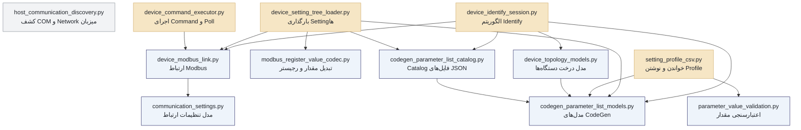
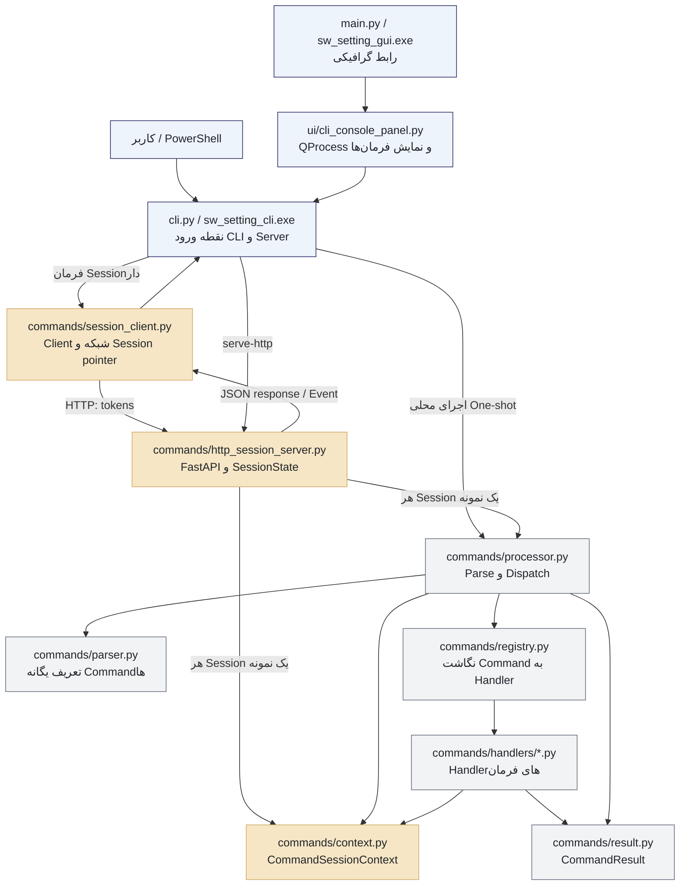

# راهنمای ارائهٔ معماری پروژه `sw_setting`

این سند برای معرفی پروژه از پایین‌ترین لایه به بالاترین لایه نوشته شده است. هدف آن توضیح جزئیات خط‌به‌خط نیست؛ بلکه باید ارائه‌دهنده بتواند با خواندن آن، مسئولیت هر فایل، ارتباط فایل‌ها و مسیر اجرای یک فرمان را روشن و منظم توضیح دهد.

> این سند رفتار نسخهٔ فعلی کد را شرح می‌دهد. فایل‌های `README.md` و `logic.md` برای شناخت طراحی اولیه مفیدند، اما مرجع نهایی رفتار برنامه خود کد است.

## ۱. هدف پروژه

`sw_setting` ابزاری برای شناسایی، تنظیم و پایش دستگاه‌های Embedded مبتنی بر Modbus است. برنامه می‌تواند از طریق Ethernet/Modbus TCP یا Serial/Modbus RTU به سخت‌افزار متصل شود و کارهای زیر را انجام دهد:

- باز و بسته‌کردن ارتباط با دستگاه؛
- خواندن و نوشتن مستقیم Holding Registerها؛
- شناسایی دستگاه‌ها و ساخت Topology؛
- انتخاب فایل JSON مناسب بر اساس `DeviceId` و `ParameterListVersion`؛
- خواندن و نوشتن پارامترهای Setting؛
- خواندن دوره‌ای پارامترهای Monitoring؛
- اجرای پارامترهای Command و بررسی پایان اجرای آن‌ها؛
- ذخیره، اعمال و بررسی Profileهای CSV؛
- ارائهٔ یک CLI قابل اسکریپت‌نویسی و یک GUI که پوسته‌ای روی همان CLI است.

معماری کلی پروژه چنین است:

```text
سخت‌افزار و فایل‌های CodeGen JSON
                 ↑
              core
                 ↑
       commands/handlers
                 ↑
 زیرساخت commands و HTTP session
                 ↑
              cli.py
                 ↑
         PowerShell یا GUI
```

اصل معماری این است که منطق سخت‌افزار و قواعد دامنه داخل `core` قرار بگیرند. Handlerها ورودی Command را به Core متصل کنند. CLI و GUI نباید الگوریتم Modbus یا Identify را دوباره پیاده‌سازی کنند.

## ۱.۱. دیاگرام ارتباطات داخلی لایهٔ Core

این نمودار فقط وابستگی‌های داخل `core` را نشان می‌دهد. جهت پیکان به معنی «استفاده می‌کند» است؛ برای مثال `device_setting_tree_loader` از `device_modbus_link` استفاده می‌کند.



`host_communication_discovery.py` در داخل Core به فایل دیگری وابسته نیست؛ خروجی آن مستقیماً توسط Handler ارتباط مصرف می‌شود. فایل‌های `device_setting_tree_loader.py` و `device_identify_session.py` هماهنگ‌کننده‌های اصلی Core هستند و چند سرویس پایه را کنار هم قرار می‌دهند.

## ۱.۲. دیاگرام ارتباطات داخلی لایه‌های بالاتر از Core

در این نمودار عمداً خود Core و اتصال Handlerها به آن نمایش داده نشده‌اند. انتهای مسیر، Handler است و هدف نمودار نشان‌دادن ورود فرمان، نگهداری Session، Parse و Dispatch در لایه‌های بالاتر است.



در مسیر HTTP، بدنهٔ فرمان فقط یک فهرست `tokens` است و `tokens[0]` نام فرمان را نگه می‌دارد. بنابراین تعریف و اعتبارسنجی آرگومان‌های هر Command فقط در `parser.py` انجام می‌شود.

---

# ۲. لایهٔ `core`: منطق اصلی پروژه

فایل‌های این پوشه وابسته به CLI یا PyQt نیستند. این لایه باید بتواند با مدل‌ها و ورودی‌های پایتونی کار کند و نتیجه یا Exception معنادار برگرداند.

## ۲.۱. `core/communication_settings.py`

این فایل مدل تنظیمات ارتباط را تعریف می‌کند و خودش ارتباطی باز نمی‌کند.

اجزای اصلی:

- `CommunicationLinkKind`: نوع لینک را مشخص می‌کند؛ در حال حاضر Serial RTU یا Ethernet TCP.
- `SerialPortCommunicationSettings`: نام COM، Baud Rate و Timeoutهای خواندن و نوشتن را نگه می‌دارد.
- `EthernetTcpCommunicationSettings`: نام و IP کارت شبکه محلی، IP دستگاه، پورت TCP و Timeoutها را نگه می‌دارد.
- `DeviceCommunicationSettings`: مدل نهایی و مشترک ارتباط است؛ نوع لینک، تنظیمات Serial یا Ethernet، Unit ID، Retry و Timeout اجرای Command را کنار هم قرار می‌دهد.

مصرف‌کنندگان اصلی این فایل `connection_commands.py` و `device_modbus_link.py` هستند. Handler اتصال، آرگومان‌های CLI را به این مدل‌ها تبدیل می‌کند و سپس مدل نهایی را به Modbus Link می‌دهد.

## ۲.۲. `core/host_communication_discovery.py`

این فایل منابع ارتباطی موجود روی کامپیوتر میزبان را کشف می‌کند؛ با دستگاه Modbus گفتگو نمی‌کند.

توابع اصلی:

- `list_available_serial_ports()`: نام و توضیح پورت‌های Serial را برمی‌گرداند.
- `list_available_serial_port_device_names()`: فقط نام Device پورت‌ها مانند `COM3` را برمی‌گرداند.
- `list_available_ipv4_network_interface_details()`: نام رابط شبکه، توضیح سخت‌افزاری و IPv4 آن را برمی‌گرداند.
- `list_available_ipv4_network_interfaces()`: نمای ساده‌تر نام رابط و IPv4 را ارائه می‌دهد.

فرمان‌های `list-serial-ports` و `list-networks` از این فایل استفاده می‌کنند. اگر یک کارت شبکه یا COM در GUI دیده نمی‌شود، مسیر عیب‌یابی از همین فایل آغاز می‌شود.

## ۲.۳. `core/device_modbus_link.py`

این فایل پایین‌ترین لایهٔ ارتباط با سخت‌افزار است و کتابخانه `pymodbus` را پشت یک API ثابت پنهان می‌کند. سایر بخش‌های پروژه نباید مستقیماً با `ModbusTcpClient` یا `ModbusSerialClient` کار کنند.

انواع اصلی:

- `DeviceModbusLinkState`: وضعیت اتصال را نگه می‌دارد.
- `DeviceModbusLinkError`: خطای استاندارد این لایه است.
- `DeviceModbusLink`: شیء ارتباطی اصلی پروژه است.

متدهای مهم `DeviceModbusLink`:

- `connect_using_settings(...)`: با استفاده از `DeviceCommunicationSettings` اتصال TCP یا Serial را باز می‌کند و اتصال قبلی را می‌بندد.
- `disconnect()`: Client فعال را می‌بندد و وضعیت اتصال را پاک می‌کند.
- `read_holding_register_u16(...)`: یک Holding Register را می‌خواند.
- `read_holding_registers_u16(...)`: چند رجیستر متوالی را می‌خواند.
- `write_holding_register_u16(...)`: یک رجیستر را می‌نویسد؛ رفتار Broadcast با Unit صفر را نیز مدیریت می‌کند.
- `write_holding_registers_u16(...)`: یک یا چند رجیستر متوالی را می‌نویسد.
- `update_active_timeouts_and_retries(...)`: Timeoutها و Retry اتصال فعال را تغییر می‌دهد.
- `set_modbus_unit_identifier_override(...)`: Unit ID مؤثر را برای فرمان‌های بعدی تغییر می‌دهد.
- `get_effective_modbus_unit_identifier()`: Unit ID نهایی مورد استفاده را برمی‌گرداند.
- متدهای `get_active_*_seconds()`: Timeout فعال خواندن، نوشتن و اجرای Command را به ثانیه می‌دهند.

این فایل پاسخ Modbus را بررسی می‌کند: پاسخ خالی، پاسخ خطای پروتکل یا Exception کتابخانه را به `DeviceModbusLinkError` تبدیل می‌کند. این فایل نام پارامترها، JSON، Profile یا Topology را نمی‌شناسد؛ فقط با آدرس، تعداد رجیستر، مقدار و Unit ID کار می‌کند.

## ۲.۴. `core/modbus_register_value_codec.py`

این فایل بین مقادیر قابل‌فهم برنامه و رجیسترهای ۱۶ بیتی Modbus تبدیل انجام می‌دهد و هیچ I/O ندارد.

توابع اصلی:

- `register_count_for_data_type_name(...)`: مشخص می‌کند یک Data Type چند رجیستر لازم دارد.
- `decode_parameter_value_from_holding_registers(...)`: فهرست رجیسترها را به `int` یا `float` تبدیل می‌کند.
- `encode_parameter_value_to_holding_registers(...)`: مقدار پایتونی را به فهرست رجیسترهای U16 تبدیل می‌کند.
- `format_decoded_parameter_value_for_display(...)`: مقدار Decodeشده را به متن مناسب نمایش تبدیل می‌کند.

قرارداد فعلی پروژه این است که رجیستر اول Word کم‌ارزش مقدار چندرجیستری است. اگر رجیسترهای خام درست باشند ولی مقدار نهایی غلط نمایش داده شود، نوع داده، اندازه Modbus و این Codec باید بررسی شوند.

## ۲.۵. `core/parameter_value_validation.py`

این فایل متن واردشده توسط کاربر یا CSV را به مقدار عددی معتبر تبدیل می‌کند.

تابع اصلی:

- `parse_and_validate_parameter_value_text(data_type_name, value_text)`: متن را بر اساس Data Type به `int` یا `float` تبدیل و محدودهٔ مجاز آن نوع را بررسی می‌کند.

خطاها با `ParameterValueValidationError` گزارش می‌شوند. این فایل آدرس Modbus یا خود دستگاه را نمی‌شناسد؛ مسئولیت آن فقط درست‌بودن شکل و محدودهٔ عدد است.

## ۲.۶. `core/codegen_parameter_list_models.py`

این فایل مدل‌های داده‌ای JSONهای تولیدشده توسط CodeGen را تعریف می‌کند.

اجزای اصلی:

- `ParameterAccessKind`: پارامتر را به Monitoring، Setting، Command یا Unknown دسته‌بندی می‌کند.
- `CodeGenDeviceDatabaseEntry`: یک سطر از بانک Device IDها.
- `CodeGenParameterListInfo`: اطلاعات کلی یک Device/Version مانند نام و تعداد پورت پایین‌دست.
- `CodeGenParameterDefinition`: تعریف یک پارامتر شامل نام، Parameter ID، آدرس، اندازه، نوع داده، نوع دسترسی، Description و Tagها.
- `CodeGenParameterListPackage`: یک نسخهٔ کامل از فهرست پارامترهای یک Device ID را نگه می‌دارد.

قابلیت‌های مهم Package:

- `count_parameters_by_access_kind()`: تعداد پارامترهای هر نوع دسترسی را می‌شمارد.
- `iter_setting_parameters()`: فقط Settingها را پیمایش می‌کند.
- `iter_command_parameters()`: فقط Commandها را پیمایش می‌کند.

ویژگی `name_path_segments` در تعریف پارامتر، نام‌هایی مانند `Foo.Bar[0]` را برای ساخت نمایش درختی به بخش‌های جدا تبدیل می‌کند.

## ۲.۷. `core/codegen_parameter_list_catalog.py`

این فایل ساختار پوشهٔ JSON را اسکن و Package درست را بر اساس `(DeviceId, ParameterListVersion)` پیدا می‌کند.

متدهای اصلی `CodeGenParameterListCatalog`:

- `scan_catalog_from_disk()`: بانک دستگاه‌ها و پوشه‌های نسخه‌دار را اسکن و Index داخلی را می‌سازد.
- `list_device_database_entries()`: دستگاه‌های بانک اصلی را برمی‌گرداند.
- `list_available_versions_for_device_id(...)`: نسخه‌های موجود یک Device ID را می‌دهد.
- `has_parameter_list_package(...)`: وجود یک Device/Version مشخص را بررسی می‌کند.
- `load_parameter_list_package(...)`: فایل Info و Parameter List را می‌خواند و `CodeGenParameterListPackage` می‌سازد.
- `find_device_database_entry_by_device_id(...)`: اطلاعات یک Device ID را در بانک دستگاه‌ها پیدا می‌کند.

این فایل هیچ رجیستری نمی‌خواند. ورودی آن مسیر فایل‌ها و شناسه‌هاست و خروجی آن مدل‌های پایتونی تعریف‌شده در فایل قبلی است.

## ۲.۸. `core/device_topology_models.py`

این فایل مدل نتیجهٔ Identify را تعریف می‌کند.

- `IdentifiedDeviceNode`: یک دستگاه شناسایی‌شده را نگه می‌دارد؛ شامل Device ID، Version، Slave ID دائمی، والد، پورت والد، تعداد پورت‌ها، فرزندان و بازه‌های Routing.
- `iter_depth_first()`: ابتدا خود Node و سپس تمام فرزندان را به‌صورت عمقی پیمایش می‌کند.
- `DeviceIdentifyResult`: ریشهٔ Topology، تعداد Slave IDهای تخصیص‌یافته و Logهای Identify را نگه می‌دارد.

Handlerهای Topology و Profile گروهی از پیمایش Depth First این مدل استفاده می‌کنند.

## ۲.۹. `core/setting_profile_csv.py`

این فایل Profile CSV را به Assignmentهای معتبر تبدیل می‌کند یا Profile را ذخیره می‌کند. خودش به Modbus دسترسی ندارد.

مدل‌های اصلی:

- `SettingProfileAssignment`: یک نام پارامتر، متن مقدار، مقدار Parseشده، تعریف پارامتر و شماره خط مبدأ را نگه می‌دارد.
- `SettingProfileParseIssue`: خطای یک ردیف CSV را با شماره خط نگه می‌دارد.
- `SettingProfileParseResult`: Assignmentهای معتبر و Issueها را کنار هم برمی‌گرداند.

توابع اصلی:

- `build_setting_parameter_definition_by_name(...)`: Settingهای مجاز را با نام Index می‌کند.
- `build_array_base_name_to_sorted_indices(...)`: اندیس‌های موجود آرایه‌ها را پیدا می‌کند.
- `load_setting_profile_assignments_from_csv(...)`: CSV را می‌خواند، Comment و خط خالی را حذف، آرایه‌ها را گسترش و مقدارها را Validate می‌کند. با `include_commands=True`، Commandها نیز مجاز می‌شوند.
- `save_setting_profile_csv(...)`: ردیف‌های `Name,Value` را بدون Header و با UTF-8 ذخیره می‌کند.

Issue یک ردیف، پردازش ردیف‌های دیگر را متوقف نمی‌کند. ردیفی مانند `Offsets[0],10,,30` به علت Cell خالی کاملاً رد می‌شود.

## ۲.۱۰. `core/device_command_executor.py`

این فایل پروتکل اجرای پارامترهای Command را پیاده می‌کند.

قرارداد پروتکل:

```text
نوشتن 0xFFFF روی رجیستر Command
             ↓
خواندن دوره‌ای همان رجیستر
             ↓
0xFFFF = هنوز در حال اجرا
0      = موفق
عدد دیگر = کد خطا
No response = احتمالاً هنوز مشغول؛ ادامه تا Timeout
```

متدهای اصلی:

- `execute_command_at_modbus_address(...)`: برای یک دستگاه، Trigger و سپس Poll را انجام می‌دهد.
- `trigger_command(...)`: فقط `0xFFFF` را می‌نویسد و پاسخ Write را کنترل می‌کند.
- `wait_for_command_completion(...)`: Command Triggerشده را تا موفقیت، خطا یا Timeout Poll می‌کند.
- `execute_command_for_units(...)`: ابتدا Trigger را برای همه Unitها ارسال می‌کند و بعد دستگاه‌های تأییدشده را یکی‌یکی Poll می‌کند.

خروجی عملیات `DeviceCommandExecutionResult` است و وضعیت موفقیت، پیام و آخرین مقدار خوانده‌شده را نگه می‌دارد.

## ۲.۱۱. `core/device_setting_tree_loader.py`

این فایل Settingهای یک دستگاه را بارگذاری می‌کند و چند سرویس Core را با هم ترکیب می‌کند.

تابع کمکی عمومی:

- `get_fixed_codegen_json_root_directory()`: در اجرای Source مسیر `files/codegen_output/JSON` پروژه و در اجرای EXE همان مسیر خارجی کنار پوشهٔ برنامه را می‌سازد. CodeGen داخل EXE یا `_internal` قرار نمی‌گیرد و با جایگزین‌کردن پوشه قابل به‌روزرسانی است.

مدل‌های خروجی:

- `DeviceMonitoringHeaderValues`: Slave ID، Device ID، Version، Serial Number و نسخه‌های Firmware/Hardware.
- `SettingParameterTreeLeafValue`: تعریف پارامتر، مقدار Decodeشده، متن نمایشی و خطای احتمالی خواندن.
- `DeviceSettingTreeLoadResult`: Package انتخاب‌شده، Header و تمام Leafهای Setting را نگه می‌دارد.

متد اصلی:

- `DeviceSettingTreeLoader.load_setting_tree_from_connected_device(...)`: ابتدا Device ID و Version را می‌خواند، Header را تکمیل می‌کند، Package مناسب را از Catalog می‌گیرد، فقط Settingها را انتخاب می‌کند، بازه‌های رجیستر مجاور را ادغام می‌کند، آن‌ها را در Batchهای حداکثر ۱۲۵تایی می‌خواند و هر پارامتر را Decode می‌کند.

نخواندن Device ID یا Version باعث شکست کل عملیات می‌شود؛ ولی خطای یک Batch یا یک Setting روی همان Leaf ثبت می‌شود تا سایر مقادیر همچنان قابل نمایش باشند.

## ۲.۱۲. `core/device_identify_session.py`

این فایل Workflow کامل Identify را اجرا می‌کند و عمیق‌ترین الگوریتم پروژه است.

ورودی‌های سازنده:

- `DeviceModbusLink` متصل؛
- مسیر Catalog JSON؛
- Callback لاگ؛
- Callback بررسی Cancel؛
- Callback ارسال Event پیشرفت.

متد عمومی اصلی:

- `run_identify()`: دستگاه ریشه را پیدا می‌کند، JSON مناسب هر دستگاه را جست‌وجو می‌کند، Slave ID دائمی اختصاص می‌دهد، تعداد پورت‌های پایین‌دست را می‌خواند، Routing هر Hub را برای اسکن تنظیم می‌کند و به‌صورت بازگشتی فرزندان را کشف می‌کند.

خروجی `DeviceIdentifyResult` است. اگر عملیات در میانه شکست بخورد، تا حد امکان Partial Topology داخل Exception نگه داشته می‌شود. Cancel از نوع Cooperative است؛ یعنی Workflow در نقاط بررسی Callback متوقف می‌شود، نه با کشتن Thread.

نبودن Package دقیق یک دستگاه دیگر Identify را متوقف نمی‌کند. نام دستگاه از `cg_database_deviceid.json` گرفته می‌شود و Node همراه `DeviceId`، `SlaveId` و `ParameterListVersion` با وضعیت «Parameter List unavailable» در Topology باقی می‌ماند. GUI آن را قرمز نشان می‌دهد و اجازه Load کردنش را نمی‌دهد. اگر چنین دستگاهی Hub باشد، خود Hub شناخته می‌شود ولی چون آدرس پارامترهای Routing بدون JSON معلوم نیست، زیرشاخه‌های آن قابل اسکن نیستند.

---

# ۳. لایهٔ Handler: واسط میان Command و Core

Handlerها در `commands/handlers` قرار دارند. آن‌ها برای جداکردن دو جهان ساخته شده‌اند:

```text
جهان Command                         جهان Core
-------------------------------     -----------------------------
argparse.Namespace                  مدل‌ها و آرگومان‌های پایتونی
نام فرمان و Optionها               عملیات Modbus و قواعد دامنه
CommandSessionContext       ←→      Link، Catalog، Loader، Codec
CommandResult و Exit Code           Result object یا Exception
```

اگر Processor مستقیماً Core را صدا می‌زد، باید منطق تمام فرمان‌ها، پیش‌شرط‌ها و شکل خروجی را در یک فایل بزرگ نگه می‌داشتیم. Handler هر گروه فرمان را جدا می‌کند و معمولاً این پنج کار را انجام می‌دهد:

1. آرگومان Parseشده را دریافت می‌کند.
2. پیش‌شرط‌هایی مانند اتصال، انتخاب Slave یا Load بودن Package را بررسی می‌کند.
3. ورودی CLI را به نوع مناسب Core تبدیل می‌کند.
4. تابع یا کلاس Core را صدا می‌زند و وضعیت Session را به‌روزرسانی می‌کند.
5. نتیجه یا Exception Core را به `CommandResult` استاندارد تبدیل می‌کند.

## ۳.۱. `commands/handlers/connection_commands.py`

فرمان‌ها:

- `connect`: مدل‌های `communication_settings.py` را از آرگومان‌ها می‌سازد و `DeviceModbusLink.connect_using_settings` را صدا می‌زند.
- `disconnect`: لینک را می‌بندد و انتخاب دستگاه و Cache Setting را پاک می‌کند.
- `status`: وضعیت Link و داده‌های ذخیره‌شده در Context را گزارش می‌کند.
- `list-serial-ports` و `list-networks`: توابع `host_communication_discovery.py` را به خروجی Command تبدیل می‌کنند.
- `set-timeouts`: تنظیمات Link فعال را به‌روزرسانی می‌کند.

این Handler نقطه اتصال زیرساخت Command به لایه ارتباط است.

## ۳.۲. `commands/handlers/modbus_raw_commands.py`

فرمان‌ها:

- `read-holding`: آدرس و تعداد را مستقیماً به `read_holding_registers_u16` می‌دهد.
- `write-holding`: `--value` یا `--values` را به فهرست U16 تبدیل و `write_holding_registers_u16` را صدا می‌زند.
- `write-holding-broadcast`: مقدار را با Unit ID صفر می‌نویسد.

این Handler کوتاه‌ترین مسیر عملیاتی از CLI تا سخت‌افزار است و برای تست ارتباط، بدون نیاز به JSON پارامترها، مناسب است.

## ۳.۳. `commands/handlers/topology_commands.py`

فرمان‌ها:

- `identify`: `DeviceIdentifySession` را با Link، مسیر JSON، Log، Cancel و Progress می‌سازد و `run_identify` را اجرا می‌کند.
- `show-topology`: نتیجه ذخیره‌شده را به JSON یا متن درختی تبدیل می‌کند؛ Identify جدیدی انجام نمی‌دهد.
- `select-device`: یک Node را با Slave ID یا Device ID انتخاب و Override لینک را تنظیم می‌کند.
- `clear-device-selection`: انتخاب و Override را پاک می‌کند.

این فایل همچنین مدل `IdentifiedDeviceNode` را برای خروجی JSON یا متن پیمایش می‌کند.

## ۳.۴. `commands/handlers/settings_commands.py`

فرمان‌ها:

- `load-settings` و `reload-settings`: `DeviceSettingTreeLoader` را اجرا و نتیجه را در Context ذخیره می‌کنند.
- `get-parameter`: تعریف پارامتر را در Package پیدا، رجیستر را Read و با Codec تبدیل می‌کند.
- `set-parameter`: فقط Setting قابل نوشتن را می‌پذیرد، مقدار را Validate و Encode می‌کند و سپس روی Link می‌نویسد.
- `list-parameters`: Metadata پارامترها را بر اساس Setting، Monitoring، Command یا Tag فیلتر می‌کند؛ I/O ندارد.
- `read-monitoring`: Parameter IDهای انتخاب‌شده را در بازه‌های مجاور تا سقف ۱۲۵ رجیستر Batch می‌کند و مقادیر را می‌خواند.
- `get-monitoring-header`: اگر Header درست در Cache باشد از آن استفاده می‌کند؛ در غیر این صورت Device ID و Version را مستقیم می‌خواند.

این Handler واسط اصلی میان Package JSON، Codec و Modbus Link است.

## ۳.۵. `commands/handlers/profile_commands.py`

فرمان‌ها:

- `parse-profile`: فقط CSV را با Package فعلی Parse و Validate می‌کند.
- `apply-profile`: Assignmentها را Encode و روی دستگاه هدف یا همه دستگاه‌های هم‌DeviceId می‌نویسد.
- `verify-profile`: مقدار دستگاه یا دستگاه‌های هدف را می‌خواند و با CSV مقایسه می‌کند.
- `save-profile`: Settingها را دوباره Load و مقادیر سالم را در CSV ذخیره می‌کند.

این Handler، `setting_profile_csv.py`، Codec، `DeviceModbusLink` و در حالت Command گروهی `DeviceCommandExecutor` را به هم متصل می‌کند. در Apply گروهی، Command با مقدار `65535` ابتدا روی همه هدف‌ها Trigger و سپس هر دستگاه تا رسیدن به صفر Poll می‌شود. مقدارهای دیگر Command همانند یک Write عادی اعمال می‌شوند.

## ۳.۶. `commands/handlers/device_command_commands.py`

فرمان‌ها:

- `list-commands`: Commandهای Package بارگذاری‌شده را فهرست می‌کند.
- `execute-command`: Command را با نام یا آدرس پیدا و `DeviceCommandExecutor` را اجرا می‌کند.

در حالت `--all-same-device-id`، Topology و Package فعلی بررسی می‌شوند؛ همه هدف‌ها باید Device ID و Parameter List Version سازگار داشته باشند. سپس Trigger همه انجام و نتیجه هر دستگاه جداگانه Poll می‌شود.

## ۳.۷. `commands/handlers/utility_commands.py`

فرمان‌ها:

- `ping`: سلامت مسیر Processor و Registry را با پاسخ `pong` بررسی می‌کند؛ Ping شبکه نیست.
- `version`: نسخه ابزار را برمی‌گرداند.
- `help`: فهرست فرمان‌ها یا Help یک Subcommand را از Parser می‌سازد.
- `set-json-root`: مسیر Catalog JSON داخل Context را تغییر می‌دهد.

این Handler معمولاً وارد منطق سخت‌افزار نمی‌شود.

تمام فایل‌های Handler یک تابع `register(registry)` دارند. این تابع نام Command را به تابع Handler متصل می‌کند؛ مثلاً:

```text
"write-holding" → handle_write_holding
"identify"      → handle_identify
"apply-profile" → handle_apply_profile
```

---

# ۴. زیرساخت پوشهٔ `commands`

فایل‌های این بخش تعیین می‌کنند Command چگونه تعریف، Parse، پیدا، اجرا و به نتیجه استاندارد تبدیل شود. Handlerها منطق هر Command را دارند؛ این فایل‌ها موتور مشترک اجرای همه Commandها هستند.

## ۴.۱. `commands/result.py`

قرارداد خروجی تمام Commandها را تعریف می‌کند.

- `CommandResult`: شامل `ok`، نام Command، دیکشنری `data`، متن `error` و `exit_code` است.
- `to_json_dict()` و `to_json_text()`: نتیجه را برای HTTP یا stdout آماده می‌کنند.
- `success(...)` و `failure(...)`: ساخت نتیجه موفق یا ناموفق را یکسان می‌کنند.

به همین دلیل CLI و GUI می‌توانند بدون شناخت نوع فرمان، نتیجه‌ها را با قالب مشترک بخوانند.

## ۴.۲. `commands/parser.py`

تمام Subcommandها، Optionها، مقدارهای پیش‌فرض و نوع آرگومان‌ها با `argparse` در این فایل تعریف شده‌اند.

- `build_argument_parser()`: Parser کامل را می‌سازد.
- `parse_command_tokens(...)`: Tokenهای از قبل جداشده را به `ParsedCommandLine` تبدیل می‌کند.
- `parse_command_line(...)`: یک خط متنی را Split و سپس Parse می‌کند.
- `ParsedCommandLine`: نام فرمان و `argparse.Namespace` آرگومان‌ها را نگه می‌دارد.

این فایل فرمان را اجرا نمی‌کند؛ فقط متن یا Token را به داده ساختاریافته تبدیل می‌کند.

## ۴.۳. `commands/registry.py`

Registry نگاشت نام فرمان به Handler را نگه می‌دارد.

- `register(name, handler)`: یک Handler را ثبت می‌کند.
- `get(name)`: تابع Handler مربوط را برمی‌گرداند.
- `list_command_names()`: نام فرمان‌های ثبت‌شده را می‌دهد.
- `build_default_registry()`: تمام فایل‌های Handler را Import و تابع `register` آن‌ها را اجرا می‌کند.

اگر فرمان در Parser تعریف شده باشد ولی Registry آن را نشناسد، تعریف Parser وجود دارد اما Handler ثبت نشده است.

## ۴.۴. `commands/context.py`

`CommandSessionContext` حافظهٔ مشترک فرمان‌های یک Session است. مهم‌ترین داده‌های آن:

- `device_modbus_link`: اتصال زنده TCP یا Serial؛
- `codegen_json_root_directory`: مسیر Catalog؛
- `last_identify_result`: آخرین Topology؛
- `selected_slave_id`: دستگاه فعال؛
- `last_settings_load_result`: Package و Settingهای آخرین Load؛
- `log_callback`: ارسال پیام Log؛
- `progress_callback`: ارسال Event پیشرفت؛
- `cancel_check`: بررسی درخواست لغو.

متدهایی مانند `require_connected`، `effective_slave_id`، `find_node_by_slave_id` و `loaded_package` پیش‌شرط‌های مشترک Handlerها را متمرکز می‌کنند.

بدون Session پایدار، این Context با پایان Process CLI از بین می‌رود. دلیل وجود HTTP Session، حفظ همین Context و اتصال Modbus بین چند فرمان جداگانه است.

## ۴.۵. `commands/processor.py`

`CommandProcessor` نقطه ورود مشترک فرمان‌های معمولی است.

مسیر `execute_tokens(...)`:

```text
Tokenها
  → parse_command_tokens
  → نام Command + Namespace
  → Registry.get
  → Handler(context, args)
  → CommandResult
```

`execute_line(...)` همین کار را برای یک رشته فرمان انجام می‌دهد. Processor خودش منطق Modbus ندارد؛ فقط Parse و Dispatch می‌کند و Exception کنترل‌نشده Handler را به Failure تبدیل می‌کند.

## ۴.۶. `commands/http_session_server.py`

این فایل سرور FastAPI چندنشستی را پیاده می‌کند.

هر `SessionState` موارد زیر را نگه می‌دارد:

- شناسه Session؛
- `CommandSessionContext` و `CommandProcessor` اختصاصی؛
- پرچم Cancel؛
- وضعیت Busy و نام Command جاری؛
- Logها و Eventهای شماره‌دار؛
- Lockهای هم‌زمانی.

Endpointهای اصلی:

| Endpoint | وظیفه |
|---|---|
| `GET /health` | سلامت سرور و تعداد Sessionها |
| `GET /sessions` | فهرست Sessionهای حافظه |
| `POST /sessions` | ساخت Context و Processor مستقل |
| `DELETE /sessions/{id}` | Cancel، Disconnect و حذف Session |
| `POST /sessions/{id}/command` | اجرای Command در همان Context |
| `POST /sessions/{id}/cancel` | روشن‌کردن `threading.Event` لغو |
| `GET /sessions/{id}/logs` | دریافت Logهای اخیر |
| `GET /sessions/{id}/events` | دریافت Eventهای شماره‌دار با Long Polling |

بدنهٔ `POST .../command` فقط به شکل `{"tokens": [...]}` پذیرفته می‌شود. عنصر اول نام Command است و Server بدون تعریف دوبارهٔ آرگومان‌ها، کل فهرست را به `CommandProcessor.execute_tokens` می‌دهد.

فرمان با `asyncio.to_thread` در Thread Pool اجرا می‌شود تا Event Loop بتواند هم‌زمان Cancel و Eventها را پاسخ دهد. در هر Session فقط یک Command هم‌زمان مجاز است؛ Sessionهای متفاوت می‌توانند مستقل کار کنند.

## ۴.۷. `commands/session_client.py`

این فایل سمت Client ارتباط HTTP است و توسط `cli.py` استفاده می‌شود.

وظایف اصلی:

- اعتبارسنجی نام Session؛
- تعیین مسیر فایل `.sw_setting_http_session.<name>.json`؛
- خواندن و حذف Pointer محلی Session؛
- `open_http_session(...)`: ارسال `POST /sessions` و ذخیره `base_url/session_id`؛
- `call_http_session_tokens(...)`: ارسال فرمان به `/command`؛
- `cancel_http_session_command(...)`: ارسال درخواست به Endpoint مستقل Cancel؛
- `iter_http_session_events(...)`: دنبال‌کردن Eventهای اجرای بعدی یک Command؛
- `close_http_session(...)`: حذف Session سرور و Pointer محلی؛
- `print_result_dict(...)`: چاپ JSON و تولید Exit Code.

فایل Pointer خود Session نیست؛ فقط نشانی Session داخل Process سرور را نگه می‌دارد.

---

# ۵. نقطه ورود `cli.py`

`cli.py` دروازهٔ برنامه برای Shell و همچنین مقصد تمام Commandهایی است که GUI با `QProcess` اجرا می‌کند.

تابع `main` ابتدا خروجی استاندارد را روی UTF-8 تنظیم، `sys.argv` را دریافت و Option عمومی `--session` را جدا می‌کند. سپس دو نوع مسیر دارد.

## ۵.۱. فرمان‌های مدیریت Session

این فرمان‌ها در خود `cli.py` مدیریت می‌شوند و وارد Parser عمومی نمی‌شوند:

- `serve-http`: `run_http_server` را صدا می‌زند و Uvicorn/FastAPI را بالا می‌آورد.
- `serve`: با `open_http_session` روی سرور موجود Session می‌سازد.
- `serve-stop`: Session را در سرور می‌بندد.
- `watch-events`: Generator رویدادها را می‌خواند و متن یا JSON Lines چاپ می‌کند.
- `cancel`: مستقیماً Endpoint Cancel را صدا می‌زند تا درگیر محدودیت Busy فرمان معمولی نشود.

## ۵.۲. فرمان‌های معمولی

اگر Pointer Session وجود داشته باشد:

```text
cli.py
  → session_client.call_http_session_tokens
  → شبکه HTTP
  → Uvicorn/FastAPI
  → http_session_server.run_command
  → CommandProcessor
  → Handler
  → Core
```

اگر Session نام‌دار درخواست شده ولی Pointer آن وجود نداشته باشد، CLI خطا می‌دهد و به اجرای محلی برنمی‌گردد.

اگر هیچ Sessionای انتخاب نشده و Pointer پیش‌فرض هم وجود نداشته باشد، `cli.py` یک `CommandSessionContext` و `CommandProcessor` موقت می‌سازد و Command را همان Process اجرا می‌کند. این حالت One-shot است؛ پس Context و اتصال با پایان فرمان از بین می‌روند.

در پایان، `CommandResult` به JSON تبدیل، روی stdout چاپ و `exit_code` آن با `raise SystemExit(main())` به سیستم‌عامل تحویل داده می‌شود.

---

# ۶. لایه GUI: پوستهٔ گرافیکی روی CLI

GUI اصل منطق برنامه نیست و هیچ Import مستقیمی از `core` ندارد. هر عمل مهم را به یک فرمان قابل کپی مانند زیر تبدیل می‌کند:

```text
python cli.py --session gui connect ...
python cli.py --session gui identify
python cli.py --session gui load-settings --slave-id 244
```

در نسخهٔ Buildشده همین فرمان‌ها با فایل اجرایی مستقل CLI نمایش داده می‌شوند:

```text
sw_setting_cli.exe --session gui connect ...
sw_setting_cli.exe --session gui identify
sw_setting_cli.exe --session gui load-settings --slave-id 244
```

## ۶.۱. `main.py`

نقطه ورود اختصاصی GUI است؛ `QApplication` را می‌سازد، آیکون `files/icon/icon.ico` را تنظیم می‌کند، `DeviceSettingMainWindow` را نمایش می‌دهد و Event Loop برنامه را اجرا می‌کند. در نسخهٔ Buildشده، `main.py` فقط در `sw_setting_gui.exe` قرار دارد و اجرای فرمان‌ها به فایل مستقل `sw_setting_cli.exe` سپرده می‌شود؛ بنابراین GUI هیچ حالت مخفی CLI ندارد.

## ۶.۲. `ui/cli_console_panel.py`

پل اصلی GUI به CLI است.

- فرمان قابل کپی می‌سازد و آن را با `QProcess` اجرا می‌کند؛
- stdout و stderr را جمع‌آوری می‌کند؛
- نتیجه JSON را به Main Window می‌دهد؛
- Session نام‌دار GUI را ایجاد، Attach یا متوقف می‌کند؛
- `watch-events` را برای نمایش زنده عملیات طولانی اجرا می‌کند؛
- History، کپی فرمان و بارگذاری/ذخیره/اجرای Script را مدیریت می‌کند.

Program و Argumentهای `QProcess` جداگانه داده می‌شوند؛ بنابراین فرمان بدون وابستگی به تفسیر Shell اجرا می‌شود، درحالی‌که متن معادل آن برای مشاهده و کپی کاربر نمایش داده می‌شود.

## ۶.۳. `ui/communication_panel.py`

کنترل‌های ارتباط Ethernet و Serial را نمایش می‌دهد، فهرست رابط‌ها را دریافت می‌کند، IP محلی مورد انتظار را بررسی می‌کند و ورودی‌های فرم را به آرگومان‌های دقیق فرمان `connect` تبدیل می‌کند. بازکردن صفحه Network Connections ویندوز نیز در همین لایه UI انجام می‌شود.

## ۶.۴. `ui/main_window.py`

پنجره اصلی و هماهنگ‌کننده تب‌هاست:

- اتصال و نمایش وضعیت Session؛
- اجرای Identify، دریافت Eventهای زنده و نمایش Topology؛
- انتخاب دستگاه و بارگذاری Settingها؛
- نمایش و ویرایش پارامترها؛
- Monitoring انتخابی و دوره‌ای؛
- اعمال، Verify و Save پروفایل؛
- فهرست و اجرای Commandها روی یک یا چند دستگاه؛
- نمایش Log و فعال/غیرفعال‌کردن دکمه‌ها بر اساس وضعیت.

Main Window نتیجه JSON فرمان‌ها را Render می‌کند، اما خواندن یا نوشتن سخت‌افزار را مستقیماً انجام نمی‌دهد.

---

# ۷. تولید نسخه و بستهٔ قابل‌انتقال Windows

## ۷.۱. `version/project_version.py` و `version/prepare_version.py`

`VERSION_MAJOR` و `VERSION_MINOR` به‌صورت دستی در `project_version.py` تعیین می‌شوند. پیش از هر Build، `prepare_version.py` دو بخش دیگر را محاسبه می‌کند:

- `Build1`: تعداد روزهای گذشته از `2000-01-01`؛
- `Build2`: تعداد ثانیه‌های گذشته از نیمه‌شب زمان محلی.

چهار مقدار در `generated_version.py` نوشته می‌شوند و عنوان برنامه به شکل زیر ساخته می‌شود:

```text
sw_setting (VMajor.Minor.Build1.Build2)
```

این فرایند به Git وابسته نیست و فایل‌های Repository را Stage نمی‌کند.

## ۷.۲. `build_exe.py`

این فایل نقطه رسمی Build ویندوز است. نسخه را یک بار تولید می‌کند، سپس دو Build جداگانهٔ PyInstaller می‌سازد و وابستگی‌های آن‌ها را در یک پوشهٔ مشترک ادغام می‌کند. خروجی نهایی از نوع `onedir` و در `dist/sw_setting/` است:

```text
dist/sw_setting/
├── sw_setting_gui.exe             رابط گرافیکی بدون پنجرهٔ Console
├── sw_setting_cli.exe             CLI و HTTP Server مستقل با Console
├── _internal/                    کتابخانه Python، PyQt و سایر dependencyها
└── files/codegen_output/JSON/    دیتابیس خارجی و قابل‌جایگزینی CodeGen
```

روی سیستم مقصد نصب Python یا Packageهای پروژه لازم نیست، ولی باید کل پوشه `dist/sw_setting` منتقل شود؛ کپی‌کردن یکی از EXEها به‌تنهایی کافی نیست، چون هر دو از `_internal` مشترک استفاده می‌کنند. CodeGen داخل فایل اجرایی قرار ندارد و کاربر می‌تواند پوشهٔ جدید `codegen_output` را جایگزین نسخه قبلی کند.

سرور را می‌توان بدون GUI اجرا کرد:

```text
sw_setting_cli.exe serve-http --host 127.0.0.1 --port 8000
```

GUI ابتدا سلامت همین آدرس محلی را بررسی می‌کند. اگر سرور از قبل فعال باشد به آن متصل می‌شود و هنگام خروج آن را نمی‌بندد؛ اگر فعال نباشد، GUI فایل `sw_setting_cli.exe` کنار خودش را برای اجرای سرور راه‌اندازی می‌کند و هنگام خروج فقط همان process تحت مالکیت خودش را متوقف می‌کند. برای دسترسی از یک رایانهٔ دیگر می‌توان سرور را صریحاً با `--host 0.0.0.0` اجرا کرد، اما چون API فعلاً authentication ندارد این حالت فقط برای شبکهٔ قابل‌اعتماد مناسب است.

---

# ۸. چهار جریان مهم برای ارائه

## ۸.۱. اتصال

```text
GUI یا PowerShell
→ cli.py
→ CommandProcessor
→ connection_commands.handle_connect
→ communication_settings
→ DeviceModbusLink.connect_using_settings
→ pymodbus TCP/Serial
```

## ۸.۲. Identify

```text
GUI یا PowerShell
→ cli.py / HTTP session
→ topology_commands.handle_identify
→ DeviceIdentifySession.run_identify
→ DeviceModbusLink + CodeGenParameterListCatalog
→ DeviceIdentifyResult
→ Context + Eventها
→ GUI/CLI
```

## ۸.۳. خواندن Settingها

```text
load-settings
→ settings_commands._load_settings_impl
→ DeviceSettingTreeLoader.load_setting_tree_from_connected_device
→ خواندن DeviceId و Version
→ CodeGenParameterListCatalog.load_parameter_list_package
→ Batch Read با DeviceModbusLink
→ Decode با modbus_register_value_codec
→ DeviceSettingTreeLoadResult در Context
```

## ۸.۴. نوشتن خام یک رجیستر

```text
write-holding --address 100 --value 7 --slave-id 244
→ cli.py
→ session_client و HTTP server، در حالت Session پایدار
→ CommandProcessor.execute_tokens
→ parser.parse_command_tokens
→ registry.get("write-holding")
→ modbus_raw_commands.handle_write_holding
→ DeviceModbusLink.write_holding_registers_u16
→ pymodbus.write_register
→ CommandResult
→ JSON خروجی
```

داده در طول این مسیر از متن Shell به Token، سپس `argparse.Namespace`، سپس ورودی عددی Core و در برگشت به `CommandResult` و JSON تبدیل می‌شود.

---

# ۹. جمع‌بندی پیشنهادی برای پایان ارائه

پروژه چهار مرز روشن دارد:

1. **Core** سخت‌افزار، JSON و منطق دامنه را می‌شناسد، ولی CLI و GUI را نمی‌شناسد.
2. **Handler** قرارداد Command را به عملیات Core ترجمه می‌کند و وضعیت Session را به‌روزرسانی می‌کند.
3. **زیرساخت Commands و CLI** ورودی را Parse، Handler را Dispatch، Session را حفظ و نتیجه را استاندارد می‌کند.
4. **GUI** فقط فرمان CLI می‌سازد، اجرا می‌کند و خروجی آن را نمایش می‌دهد.

مزیت این ساختار آن است که یک عملیات مانند `write-holding`، `identify` یا `apply-profile` از PowerShell، Script و GUI از یک مسیر مشترک عبور می‌کند. بنابراین رفع خطا در Handler یا Core، رفتار همه رابط‌ها را هم‌زمان اصلاح می‌کند و GUI به پیاده‌سازی موازی منطق سخت‌افزار تبدیل نمی‌شود.
